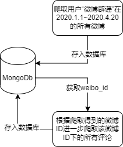

# 小组

## 结构

```
├───analyze
│   ├───BOM             将data中的数据以 utf8 with BOM 转码 以便用excel打开
│   ├───data            分析中用到的数据项
│   └───statistic       统计部分
├───docs                文档
└───weibospider         爬虫
```

## analyze

- clean 数据清洗
- fit 对评论数与点赞数，转发数的关系进行回归。
- senti_1 计算每条评论的情感积极概率
- senti_2 计算每条微博下的评论积极概率
- merge 将评论积极概率和微博点赞数，转发数，评论数合并。
- rei 计算每条微博的 rei 值

> 在实际分析过程中舍弃了一部分评论。例如，有些微博没有评论，有些评论无法分析情感，例如“，” “。”

## weibospider

使用github上现有的项目

https://github.com/nghuyong/WeiboSpider


